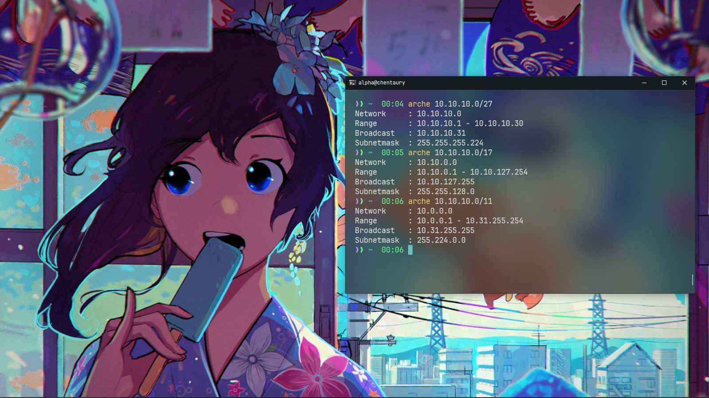

</p>

## Usage
before you use this tool , for linux user or darwin user you can copy file `bin/arche` into your `/usr/local/bin` or `/bin` folder. If your user windows you can use file `bin/arche.exe` to running arche command

```bash
arche 192.168.10.10/24
```
